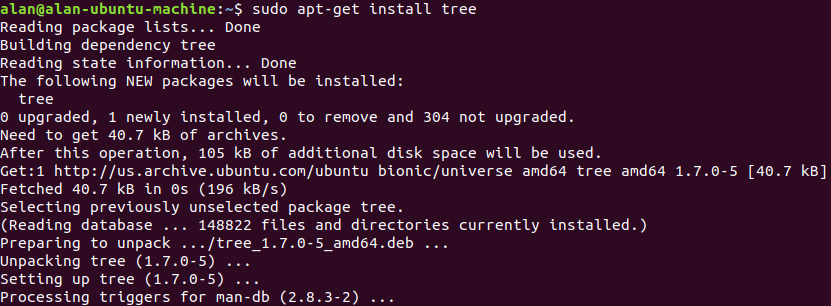
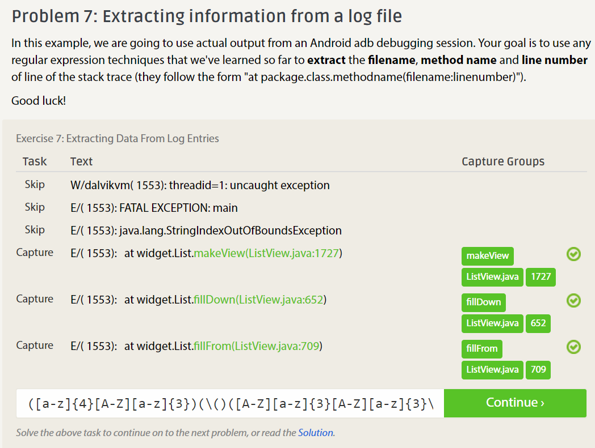
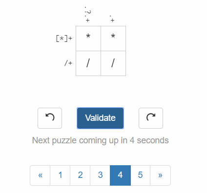

###c.
1.	1. Must be Free
	2. Must include Source Code
	3. Must allow Derived Works
	4. Must preserve the original source code, unless "patch files" are included to show the changes from the source.
	5. No Discriminatory code.
	6. No rules on how it is used.
	7. Rights to use software must come with all further distributions of the software. 
	8. The License to use a software must not be locked to the full product.
	9. The License to use a software must not restrict usage of other software.
	10. License to use the software must not have conditions dependant on the technology it is being used with.
2.  1. Don't hide information. It may be relevant even if you think it's not.
    2. Give feedback if possible. 
3.  The chapter's main theme seems to be that the RIAA, the Recording Industry Association of America, is corrupt, 
	effectively takes whatever chance it can to take advantage of the legal system to take money from people. 
	I agree with this idea, but the chapter stops short of what I think is the real takeaway from this: the legal 
	system itself allows and enables corporations to take advantage of people. The chapter asks the reader to think
	about the morality of the RIAA, and how they take money away from innocents instead of lobbying for what they want
	with their immense amount of money, but I wonder why not look a further step up, at th system that almost encourages
	such behavior. At the lowest level, you could think that Jesse deserved what he got for not looking into copyright 
	laws. Going another step above, you could say that the RIAA is at fault, for picking on a kid who was just tinkering,
	as the school encouraged him to. But I think going higher is necessary, and thinking about whether the legal systems
	that allow these kinds of abuses is morally right is an important step.
###d.
Photo: 
###e.
2. Photo: 
	Unsure if this is enough proof. The wording on the problem is vague.
3. Photo: 
	Unsure if this is enough proof. Wording on problem is vague.
###f.

